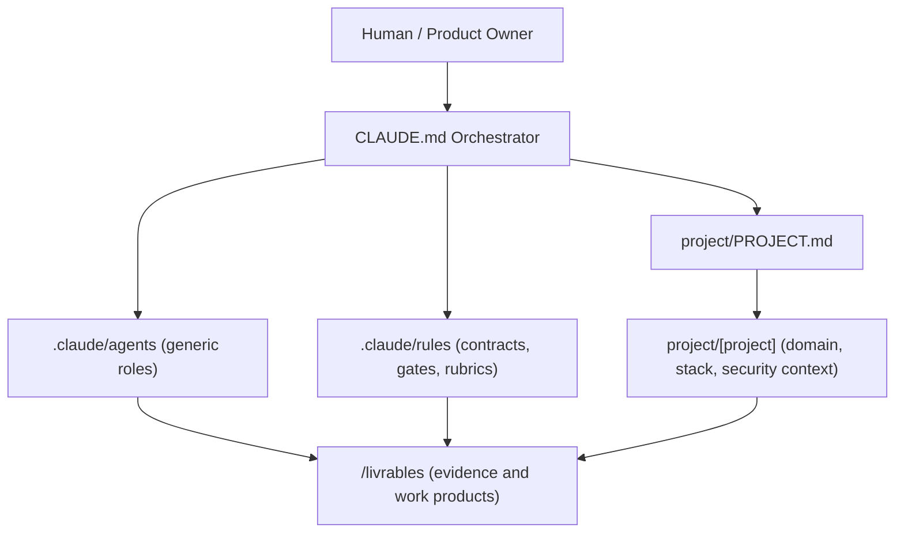
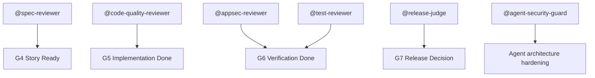

# Project And Agent Orchestration

This document gives a structural view of the project-agnostic AI Dev Chain.

## Repository Structure

```text
.
├── CLAUDE.md                     # copied from the platform template at project creation
├── .claude/                      # reusable framework; read-only for agents
│   ├── agents/                   # generic roles (sponsor, ux, ui-designer, po, developpeur, …)
│   ├── rules/                    # contracts, gates, security, judge rubrics, UI quality, runtime safety
│   ├── skills/
│   ├── mcp.json
│   ├── ORCHESTRATION.md
│   ├── VERIFICATION.md
│   └── control-center/           # platform-owned state (runs, spend, registers); not edited by agents
├── project/                      # project profile, written by @project-bootstrapper
│   ├── PROJECT.md
│   └── [project-slug]/
│       ├── context.md            # domain, users, domain seed
│       ├── stack.md
│       ├── security-context.md
│       └── intake-inventory.md
└── livrables/
    ├── 00-contexte/
    ├── 01-vision/
    ├── 02-ux/
    ├── 02-ui/
    ├── 03-architecture-metier/   # incl. dev-waves.json (BC dependency order for G5)
    ├── 04-architecture-technique/
    ├── 05-backlog/
    ├── 06-dev/
    ├── 07-tests/
    ├── 08-devops/
    ├── 09-feedback/
    ├── 10-security/
    ├── 11-evaluations/
    ├── _inputs/                  # human-provided documents per phase
    └── _governance/              # gates, decisions, risks, tasks, agent-io (platform contract)
project-intake/
    ├── 00-brief/
    ├── 01-business/
    ├── 02-users/
    ├── 03-processes/
    ├── 04-data/
    ├── 05-systems/
    ├── 06-constraints/
    ├── 07-security-compliance/
    ├── 08-design-brand/
    └── 09-existing-assets/
```

## Layering



## End-To-End Flow

```mermaid
flowchart LR
  Intake["Project intake docs"] --> Bootstrapper["@project-bootstrapper"]
  Bootstrapper --> A["G0 Project Context"]
  A --> B["@sponsor"]
  B --> DR1["@discovery-reviewer"]
  DR1 --> C["G1 Vision"]
  C --> D["@ux"]
  C --> E["@architecte-metier"]
  E --> D
  D --> E
  D --> UI["@ui-designer"]
  E --> UI
  UI --> DR2["@discovery-reviewer"]
  E --> DR2
  DR2 --> F["G2 Domain, UX And UI Ready"]
  F --> G["@architecte-technique"]
  F --> H["@security-architect"]
  G --> I["@architecture-reviewer"]
  H --> I
  I --> J["G3 Architecture + Security"]
  J --> K["@po"]
  K --> L["@spec-reviewer"]
  L --> M["G4 Story Ready"]
  M --> N["@developpeur"]
  N --> O["@code-quality-reviewer"]
  O --> P["G5 Implementation Done"]
  P --> Q["@qa"]
  P --> R["@appsec-reviewer"]
  Q --> S["@test-reviewer"]
  S --> T["G6 Verification Done"]
  R --> T
  T --> U["@devops"]
  U --> V["@release-judge"]
  V --> W["G7 Release Decision"]
  W --> X["@end-user"]
  X --> K
```



## Judge And Review Gates



## Reuse Model

```text
Reusable:
  .claude/agents/*
  .claude/rules/*
  CLAUDE.md orchestration model

Replace per project:
  project/PROJECT.md
  project/[project]/*   (context with the domain seed, stack, security context)

Generated during delivery:
  /livrables/*
```
